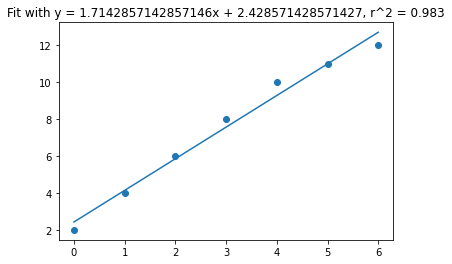

# Linear Regression with two different methods

## normal.ipynb

This file implements normal equation linear algebra to come up with a line to fit the data

## gradientdescent.ipynb

This file inplements batch gradient descent to minimize the mean squared loss to fit a line to the data 

# Line Fit

